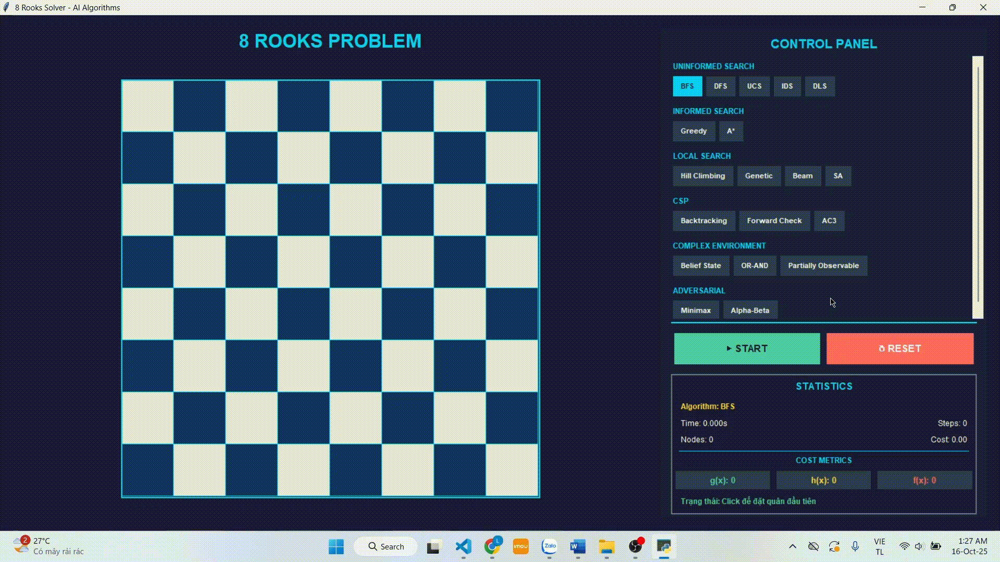

# RookSolverAI - Đặt 8 quân xe bằng thuật toán AI

## Thông tin đồ án

| Thông tin               | Chi tiết                 |
| ----------------------- | ------------------------ |
| **Môn học**             | Trí tuệ nhân tạo         |
| **Giảng viên**          | TS. Phan Thị Huyền Trang |
| **Lớp học phần**        | 251ARIN330585_05CLC      |
| **Sinh viên thực hiện** | Trần Hữu Lộc             |
| **Mã số sinh viên**     | 23110123                 |

---

## 1. Giới thiệu

### 1.1. Giới thiệu về bài toán 8 quân Xe

Bài toán 8 quân Xe là một bài toán kinh điển trong lĩnh vực trí tuệ nhân tạo và khoa học máy tính. Mục tiêu của bài toán là đặt 8 quân Xe lên bàn cờ 8x8 sao cho không có hai quân nào tấn công nhau.

**Quy tắc cơ bản:**

- Quân Xe trong cờ vua có thể di chuyển theo chiều ngang hoặc chiều dọc không giới hạn số ô
- Hai quân Xe được coi là tấn công nhau nếu chúng nằm trên cùng một hàng hoặc cùng một cột
- Lời giải hợp lệ là cấu hình mà 8 quân Xe được đặt trên bàn cờ mà không có hai quân nào cùng hàng hoặc cùng cột

Bài toán này là một dạng đặc biệt của bài toán thỏa mãn ràng buộc (Constraint Satisfaction Problem - CSP), thường được sử dụng để minh họa và so sánh hiệu quả của các thuật toán tìm kiếm trong AI.

### 1.2. Giới thiệu về ứng dụng RookSolverAI

RookSolverAI là một chương trình mô phỏng trực quan việc giải bài toán đặt 8 quân Xe bằng nhiều thuật toán trí tuệ nhân tạo khác nhau. Chương trình được phát triển nhằm mục đích:

- Minh họa cách hoạt động của các thuật toán AI Search
- So sánh hiệu suất giữa các thuật toán
- Hỗ trợ học tập và nghiên cứu về trí tuệ nhân tạo

### 1.3. Giao diện ứng dụng

Giao diện của RookSolverAI được thiết kế đơn giản, trực quan với các thành phần chính:

**Các thành phần chính:**

- **Bàn cờ 8x8:** Hiển thị trạng thái hiện tại của bàn cờ và vị trí các quân Xe
- **Bảng chọn thuật toán:** Cho phép người dùng lựa chọn thuật toán muốn sử dụng
- **Nút điều khiển:** Bao gồm các nút Start, Reset
- **Bảng thống kê:** Hiển thị các thông số như thời gian chạy, số nút mở rộng, độ sâu tìm kiếm
- **Vùng trực quan hóa:** Hiển thị quá trình tìm kiếm dưới dạng animation

### 1.4. Các chức năng chính

**1. Lựa chọn thuật toán:**

- Người dùng có thể chọn từ 15+ thuật toán AI khác nhau
- Phân loại theo nhóm: Uninformed Search, Informed Search, Local Search, CSP, Adversarial Search

**2. Điều khiển quá trình tìm kiếm:**

- **Start:** Bắt đầu chạy thuật toán đã chọn
- **Reset:** Đặt lại bàn cờ về trạng thái ban đầu

**3. Trực quan hóa:**

- Hiển thị animation quá trình đặt quân Xe
- Highlight các ô đang được xem xét

**4. Thống kê và đánh giá:**

- Thời gian thực thi (ms)
- Số lượng nút được mở rộng
- Trạng thái kết quả (thành công/thất bại)

---

## 2. Nội dung

### 2.1. Nhóm thuật toán Tìm kiếm Không có Thông tin (Uninformed Search)

Các thuật toán tìm kiếm không có thông tin (còn gọi là tìm kiếm mù) không sử dụng bất kỳ thông tin bổ sung nào về bài toán ngoài định nghĩa về trạng thái hợp lệ và trạng thái đích. Chúng tìm kiếm một cách có hệ thống nhưng không có định hướng cụ thể.

#### 2.1.1. BFS (Breadth-First Search)

**Mô tả:**  
BFS duyệt không gian tìm kiếm theo chiều rộng, lần lượt đặt Xe vào từng hàng và thử tất cả các khả năng ở mỗi tầng trước khi chuyển sang tầng sâu hơn.

  

**Cơ chế hoạt động:**

1. Bắt đầu với bàn cờ trống (trạng thái ban đầu)
2. Đặt Xe vào hàng đầu tiên, thử tất cả 8 cột
3. Với mỗi vị trí hợp lệ, tiếp tục đặt Xe vào hàng tiếp theo
4. Mở rộng tất cả trạng thái cùng mức trước khi sang mức sâu hơn
5. Dừng khi tìm được cấu hình có đủ 8 Xe không xung đột

**Ưu điểm:**

- Đảm bảo tìm được nghiệm tối ưu với số bước ít nhất
- Hoàn thiện: luôn tìm được nghiệm nếu có

**Nhược điểm:**

- Tiêu tốn rất nhiều bộ nhớ do phải lưu toàn bộ trạng thái cùng mức
- Tốc độ chậm khi không gian tìm kiếm lớn

**Độ phức tạp:**

- Thời gian: O(b^d) với b là branching factor, d là độ sâu
- Không gian: O(b^d)

---

#### 2.1.2. DFS (Depth-First Search)

**Mô tả:**  
DFS duyệt không gian tìm kiếm theo chiều sâu, đặt Xe vào hàng đầu tiên và đi sâu xuống các hàng tiếp theo cho đến khi gặp xung đột hoặc tìm được nghiệm, sau đó quay lui.

  

**Cơ chế hoạt động:**

1. Bắt đầu đặt Xe vào cột đầu tiên của hàng đầu tiên
2. Tiếp tục đặt Xe vào hàng tiếp theo theo chiều sâu
3. Nếu gặp xung đột, quay lui và thử cột khác
4. Lặp lại cho đến khi tìm được nghiệm hoặc hết khả năng

**Ưu điểm:**

- Tiết kiệm bộ nhớ (chỉ lưu đường đi hiện tại)
- Dễ cài đặt bằng đệ quy
- Nhanh chóng tìm được một nghiệm (không nhất thiết tối ưu)

**Nhược điểm:**

- Không đảm bảo nghiệm tối ưu
- Có thể đi vào nhánh sai và mất thời gian
- Có thể rơi vào vòng lặp vô hạn nếu không kiểm soát

**Độ phức tạp:**

- Thời gian: O(b^m) với m là độ sâu tối đa
- Không gian: O(bm)

---

#### 2.1.3. DLS (Depth-Limited Search)

**Mô tả:**  
DLS là phiên bản cải tiến của DFS với giới hạn độ sâu tìm kiếm. Thuật toán sẽ dừng lại khi đạt đến độ sâu giới hạn đã định trước.

  

**Cơ chế hoạt động:**

1. Hoạt động giống DFS nhưng với giới hạn độ sâu L
2. Khi đạt độ sâu L, dừng và quay lui
3. Thử các nhánh khác cho đến khi tìm được nghiệm hoặc duyệt hết

**Ưu điểm:**

- Tránh việc đi sâu vô hạn trong không gian tìm kiếm
- Tiết kiệm bộ nhớ như DFS
- Phù hợp khi biết trước giới hạn độ sâu nghiệm

**Nhược điểm:**

- Không hoàn thiện: nếu giới hạn nhỏ hơn độ sâu nghiệm, sẽ không tìm thấy
- Khó xác định giới hạn độ sâu phù hợp

**Độ phức tạp:**

- Thời gian: O(b^l) với l là giới hạn độ sâu
- Không gian: O(bl)

---

#### 2.1.4. IDS (Iterative Deepening Search)

**Mô tả:**  
IDS kết hợp ưu điểm của BFS và DFS bằng cách thực hiện DLS nhiều lần với giới hạn độ sâu tăng dần (0, 1, 2, ...).

  

**Cơ chế hoạt động:**

1. Chạy DLS với giới hạn độ sâu = 0
2. Nếu không tìm được nghiệm, tăng giới hạn lên 1 và chạy lại
3. Tiếp tục tăng dần cho đến khi tìm được nghiệm

**Ưu điểm:**

- Hoàn thiện như BFS
- Tiết kiệm bộ nhớ như DFS
- Tìm được nghiệm tối ưu

**Nhược điểm:**

- Phải duyệt lại nhiều lần các trạng thái ở tầng nông
- Chậm hơn BFS về mặt thời gian thực

**Độ phức tạp:**

- Thời gian: O(b^d)
- Không gian: O(bd)

---

#### 2.1.5. UCS (Uniform Cost Search)

**Mô tả:**  
UCS luôn mở rộng trạng thái có chi phí tích lũy thấp nhất. Trong bài toán 8 Xe, chi phí có thể là số lượng xung đột hoặc số bước đã thực hiện.

  

**Cơ chế hoạt động:**

1. Sử dụng priority queue để lưu các trạng thái
2. Luôn chọn trạng thái có chi phí g(n) nhỏ nhất để mở rộng
3. Cập nhật chi phí khi tìm được đường đi rẻ hơn
4. Dừng khi tìm được trạng thái đích

**Ưu điểm:**

- Đảm bảo tìm được nghiệm có chi phí tối ưu
- Hoàn thiện và tối ưu

**Nhược điểm:**

- Tốn thời gian nếu không gian trạng thái lớn
- Cần định nghĩa hàm chi phí phù hợp
- Tốn bộ nhớ để lưu trữ priority queue

**Độ phức tạp:**

- Thời gian: O(b^(C*/ε)) với C* là chi phí nghiệm tối ưu
- Không gian: O(b^(C\*/ε))

---

### 2.2. Nhóm thuật toán Tìm kiếm Có Thông tin (Informed Search)

Các thuật toán tìm kiếm có thông tin sử dụng hàm heuristic để ước lượng mức độ "gần" với trạng thái đích, giúp định hướng tìm kiếm hiệu quả hơn.

#### 2.2.1. Greedy Best-First Search

**Mô tả:**  
Greedy Best-First Search luôn chọn trạng thái có giá trị heuristic h(n) nhỏ nhất để mở rộng. Trong bài toán 8 Xe, h(n) thường là số cặp Xe đang xung đột.

  

**Hàm Heuristic:**

- h(n) = số lượng cặp Xe xung đột với nhau
- h(n) = số hàng/cột còn thiếu Xe

**Ưu điểm:**

- Chạy nhanh, thường tìm được nghiệm trong thời gian ngắn
- Dễ cài đặt và hiểu
- Tiết kiệm bộ nhớ hơn BFS

**Nhược điểm:**

- Không đảm bảo nghiệm tối ưu
- Dễ rơi vào cực trị cục bộ
- Phụ thuộc nhiều vào chất lượng hàm heuristic

---

#### 2.2.2. A\* (A-Star Search)

**Mô tả:**  
A\* kết hợp chi phí thực tế g(n) và ước lượng h(n) thông qua hàm đánh giá f(n) = g(n) + h(n).

  

**Hàm đánh giá:**

- g(n) = số Xe đã đặt hoặc chi phí thực tế từ trạng thái ban đầu
- h(n) = số xung đột còn lại (heuristic khả chấp)
- f(n) = g(n) + h(n)

**Ưu điểm:**

- Đảm bảo tìm được nghiệm tối ưu nếu h(n) là heuristic khả chấp
- Hiệu quả hơn UCS nhờ có định hướng
- Cân bằng giữa tốc độ và độ chính xác

**Nhược điểm:**

- Tốn bộ nhớ để lưu trữ các trạng thái
- Cần thiết kế hàm heuristic tốt
- Chậm hơn Greedy nhưng đáng tin cậy hơn

---

### 2.3. Nhóm thuật toán Tối ưu Cục bộ (Local Search)

Các thuật toán tối ưu cục bộ không tìm kiếm toàn bộ không gian mà chỉ tập trung cải thiện dần lời giải hiện tại từ một trạng thái ngẫu nhiên ban đầu.

#### 2.3.1. Hill Climbing

**Mô tả:**  
Hill Climbing bắt đầu từ một cấu hình ngẫu nhiên và liên tục di chuyển các quân Xe để giảm số xung đột.

  

**Ưu điểm:**

- Đơn giản, dễ cài đặt
- Chạy nhanh với không gian tìm kiếm lớn
- Tiết kiệm bộ nhớ

**Nhược điểm:**

- Dễ rơi vào cực trị cục bộ
- Không đảm bảo tìm được nghiệm tối ưu toàn cục

---

#### 2.3.2. Simulated Annealing

**Mô tả:**  
Simulated Annealing cải tiến Hill Climbing bằng cách đôi khi chấp nhận các bước đi "xấu hơn" với xác suất giảm dần theo thời gian (nhiệt độ).

  

**Ưu điểm:**

- Có khả năng thoát khỏi cực trị cục bộ
- Tìm được nghiệm tốt hơn Hill Climbing

**Nhược điểm:**

- Phụ thuộc vào tham số nhiệt độ và tốc độ giảm nhiệt
- Khó điều chỉnh tham số

---

#### 2.3.3. Beam Search

**Mô tả:**  
Beam Search duy trì một số lượng giới hạn (beam width) các trạng thái tốt nhất ở mỗi bước để mở rộng tiếp.

  

**Ưu điểm:**

- Cân bằng giữa tốc độ và độ bao phủ
- Linh hoạt thông qua tham số beam width

**Nhược điểm:**

- Có thể bỏ lỡ nghiệm tối ưu nếu beam width quá nhỏ

---

#### 2.3.4. Genetic Algorithm

**Mô tả:**  
Genetic Algorithm mô phỏng quá trình tiến hóa tự nhiên với các thao tác: chọn lọc, lai ghép và đột biến.

  

**Ưu điểm:**

- Mạnh mẽ với không gian tìm kiếm phức tạp
- Có thể tìm nghiệm tốt trong không gian rất lớn

**Nhược điểm:**

- Cần nhiều tham số (kích thước quần thể, xác suất lai/đột biến)
- Mất thời gian huấn luyện

---

### 2.4. Nhóm thuật toán Môi trường Phức tạp (Complex Environment)

#### 2.4.1. AND-OR Search

  

Mô phỏng quá trình ra quyết định khi có nhiều kết quả có thể xảy ra hoặc có ràng buộc phụ thuộc giữa các vị trí Xe.

---

#### 2.4.2. Partially Observable Search

  

Áp dụng khi một số vị trí trên bàn cờ bị ẩn hoặc không thể quan sát được, thuật toán phải dự đoán dựa trên thông tin có sẵn.

---

#### 2.4.3. Belief-State Search

  

Mỗi trạng thái là một tập hợp các khả năng có thể xảy ra, hữu ích khi có yếu tố không chắc chắn.

---

### 2.5. Nhóm thuật toán Ràng buộc (CSP - Constraint Satisfaction Problem)

#### 2.5.1. Backtracking

**Mô tả:**  
Backtracking đặt Xe từng bước một, nếu phát hiện xung đột thì quay lui và thử lựa chọn khác.

  

**Ưu điểm:**

- Đơn giản, dễ hiểu
- Hiệu quả với các ràng buộc mạnh

**Nhược điểm:**

- Có thể tốn thời gian với không gian lớn
- Lặp lại nhiều phép thử

---

#### 2.5.2. Forward Checking

**Mô tả:**  
Khi đặt một Xe, Forward Checking loại bỏ ngay các vị trí không hợp lệ của các Xe chưa đặt.

  

**Ưu điểm:**

- Giảm đáng kể số lần quay lui
- Phát hiện sớm các ràng buộc vi phạm

**Nhược điểm:**

- Cần quản lý miền giá trị của các biến

---

#### 2.5.3. AC-3 (Arc Consistency)

**Mô tả:**  
AC-3 duy trì tính nhất quán trên các cung (Xi, Xj), loại bỏ các giá trị không nhất quán trước khi tìm kiếm.

  

**Ưu điểm:**

- Rút gọn miền giá trị hiệu quả
- Giảm thời gian tìm kiếm tổng thể

**Nhược điểm:**

- Phức tạp hơn về mặt triển khai

---

### 2.6. Nhóm thuật toán Đối kháng (Adversarial Search)

#### 2.6.1. Minimax

**Mô tả:**  
Minimax đánh giá các nước đi dựa trên việc tối thiểu hóa thiệt hại trong trường hợp xấu nhất, áp dụng cho trò chơi hai người.

  

**Ưu điểm:**

- Đảm bảo nước đi an toàn nhất
- Phù hợp cho trò chơi đối kháng

**Nhược điểm:**

- Tốn thời gian nếu không cắt tỉa

---

#### 2.6.2. Alpha-Beta Pruning

**Mô tả:**  
Alpha-Beta Pruning cải tiến Minimax bằng cách loại bỏ các nhánh không cần thiết trong cây trò chơi.

  

**Ưu điểm:**

- Giảm đáng kể thời gian tính toán
- Cho kết quả giống Minimax nhưng nhanh hơn

**Nhược điểm:**

- Hiệu quả phụ thuộc vào thứ tự duyệt

---

## 3. Kết quả và Đánh giá

**Nhóm Uninformed Search:**

- BFS và IDS đảm bảo nghiệm tối ưu nhưng tốn tài nguyên
- DFS và DLS nhanh nhưng không đảm bảo tối ưu
- UCS tốt khi có hàm chi phí rõ ràng

**Nhóm Informed Search:**

- A\* là lựa chọn tốt nhất cho bài toán này: cân bằng giữa tốc độ và độ chính xác
- Greedy nhanh nhưng có thể cho kết quả không tối ưu

**Nhóm Local Search:**

- Hill Climbing và Simulated Annealing rất nhanh với không gian lớn
- Genetic Algorithm mạnh mẽ nhưng cần điều chỉnh tham số

**Nhóm CSP:**

- Forward Checking và AC-3 là hi

## 4. Tài liệu tham khảo

- Russell, S., & Norvig, P. (2021). Artificial Intelligence: A Modern Approach (4th ed.). Pearson.
